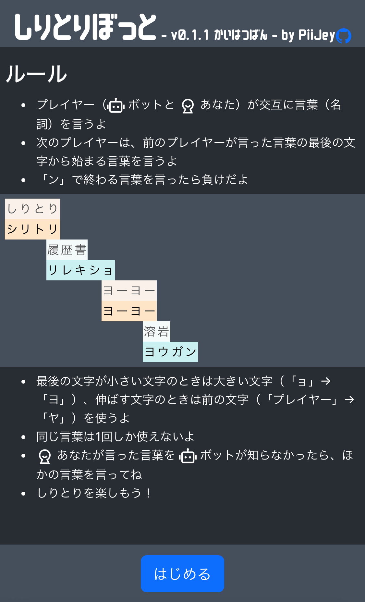
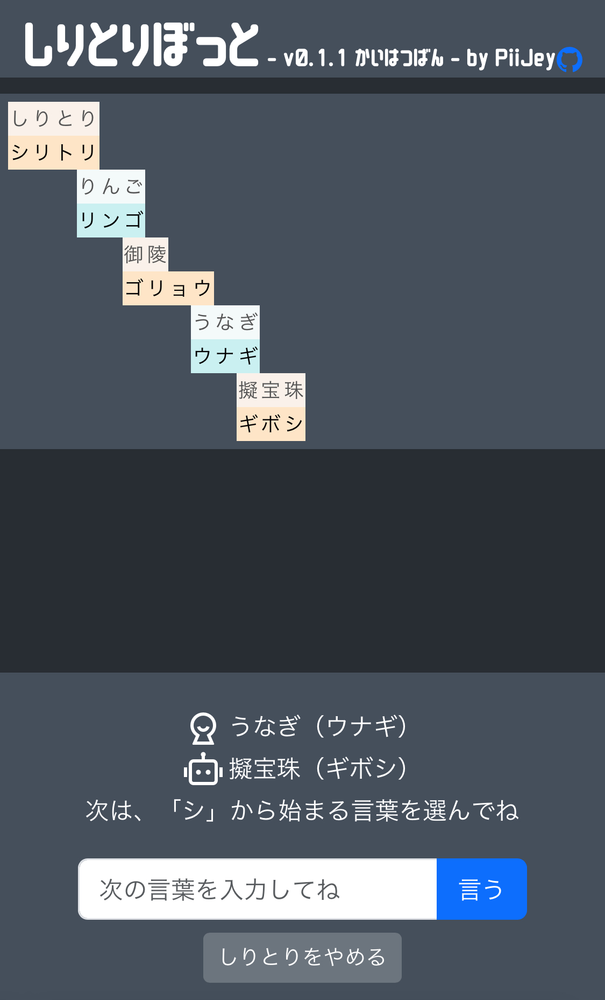
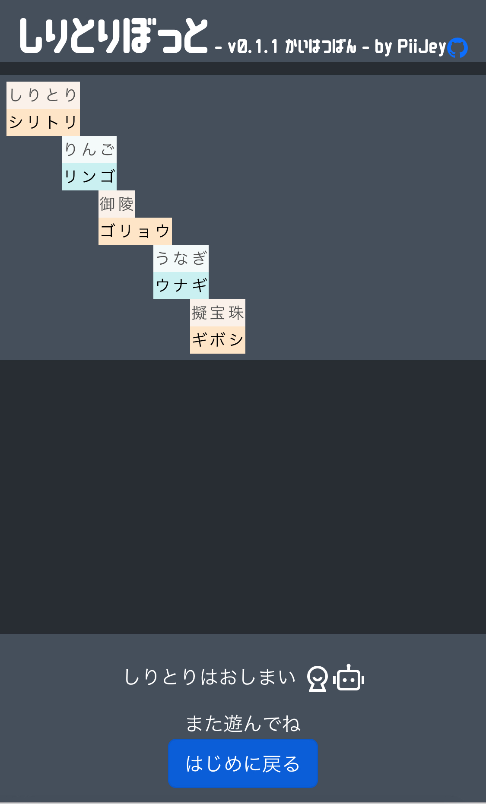

# しりとりぼっとの詳細

アプリは主に3つのページで構成されています。
- 開始前ページ (`waitingPage`)
- ゲーム中 (`progressPage`)
- 終了後 (`finishedPage`)

以下では、各ページの概要を説明し、それから React の状態管理を使用した**ゲームの流れ**を説明します。

## 各ページの概要
アプリの主なロジックは [`src/App.js`](./src/App.js) の React コンポーネントで定義されています。ゲームの状態（開始前／ゲーム中／終了後）は、[`src/components/GameStateManager.js`](./src/components/GameStateManager.js) で管理されています。

### 開始前ページ (`waitingPage`)
アプリにアクセスすると最初に表示されるページです。



- ユーザーがルールを読んでいる間に、形態素解析器の辞書データの読み込みを行います
- 辞書データの読み込みが完了すると、「はじめる」ボタンがアクティブになり、ボタンを押してゲームを開始することができます


### ゲーム中ページ (`progressPage`)
ゲームが始まると、このページが表示されます。



- 中央にはしりとりグリッドボードが表示され、これまでに出た単語を一覧できます
- しりとりグリッドボードはゲームの進行に合わせて最新の単語に自動でスクロールします
- 下部にはプレイヤー（ユーザーまたはぼっと）が選択した単語と、システムからのメッセージが表示されます
- 入力ボックスに次の単語を入力するか、「しりとりをやめる」ボタンを押してゲームを終了することができます


### 終了後ページ (`finishedPage`)
ゲームが終了すると、このページが表示されます。



- しりとりグリッドボードが表示されているので、ゲーム中に出た単語を振り返ることができます
- 「はじめに戻る」ボタンを押すと、ゲーム開始前ページに戻り、新しいゲームを開始することができます


## ゲームの流れ
しりとりぼっとでは、ゲームの各ターンの情報を **〈現在のターン〉オブジェクト (`currentTurnInfo`)** で管理しています。この情報をアプリの各コンポーネントが props として受け取り、React の状態管理機能を活用して、`currentTurnInfo` のプロパティを更新します。

`currentTurnInfo` の例

```js
{
    word: "りんご", // 現在のターンで言われた単語
    wordReading: "リンゴ", // 単語の読み
    nextStartWith: "ゴ", // 次のターンの最初の文字
    validationResult: true, // ルール評価結果 // null (未判定), true (ルールに沿っている), false (沿っていない)
    validationInfo: null, // ルール評価結果の詳細
    player: "user", //プレイヤー // user (ユーザー), system (ぼっと)
}
```

### 1. プレイヤーのターン
単語とその読みを `currentTurnInfo` に格納します。入力された単語がゲームのルールに沿っているかどうかは、この時点ではまだ評価していないので、`validationResult` プロパティは `null` に設定します。

#### ユーザーのターン
ユーザーが単語を入力すると、`WordSubmissionForm` コンポーネントがアクティブになります。このコンポーネントでは、入力された単語の読みを形態素解析器を使用して取得し、その情報を`currentTurnInfo` に格納します。ユーザーの入力したテキストが名詞以外や未知語の場合、エラー情報を格納します。この時、プレイヤーとしてユーザー (`user`) を設定します。

#### ぼっとのターン
ぼっとのターンでは、`SystemWordSelector` コンポーネントが動作します。「しりとり辞書」から単語を選択して、`currentTurnInfo` に格納します。この時、プレイヤーとしてぼっと (`system`) を設定します。

選択された単語について、Wikipedia ページの概要を [Wikimedia REST API](https://ja.wikipedia.org/api/rest_v1/) から取得します。

### 2. ルール評価
プレーヤーが単語を選択／入力した後、その単語がゲームのルールに沿っているかどうかを`RuleValidator` コンポーネントで評価します（単語が適切な文字で始まっているか、「ン」で終わっていないかなど）。評価結果は、`currentTurnInfo` の `validationResult` プロパティに格納します。

### 3. ゲーム状態の更新
ルール評価結果に応じて、`GameStateManager` コンポーネントで、ゲームの状態を更新します。入力／選択された単語がルールに沿っている場合、しりとりグリッドボードに単語が追加し、ゲームは次のターンに進みます。しりとりグリッドボードは、 `ShiritoriGrid` コンポーネントで視覚的に表示します。

### 4. システムメッセージ
ルール評価結果に応じて、`MessageManager` コンポーネントで、システムメッセージを更新します。システムメッセージで、入力／選択された単語、次の単語の開始文字などの情報をユーザーにお知らせします。
